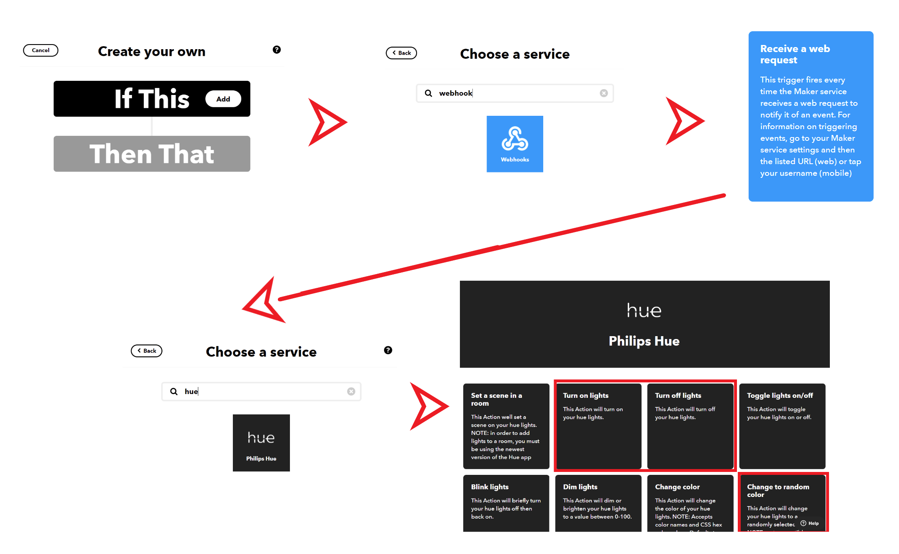

## Office Light Switch App
An app to control Phillip Hue lights in your house from a mobile app build with [Xamarin.Forms](https://xamarin.com/forms) for iOS, Android, and Windows.

## Setup

### Windows
Download [Visual Studio](https://visualstudio.microsoft.com/downloads/) (for free!) and make sure to check off the "Mobile Development with .NET" workload.
Already have VS installed? Go to the Visual Studio Installer > Modify then check off Mobile Development with .NET.

#### Choose your target device
You can run this app on your phone or on an emulator! The easiest thing to do is use a physical device.

* For iPhones or iPads, follow the instructions [here](https://docs.microsoft.com/en-us/xamarin/xamarin-forms/deploy-test/hot-restart).
* For Android devices, follow the instructions [here](https://docs.microsoft.com/en-us/xamarin/android/get-started/installation/set-up-device-for-development) and [here](https://docs.microsoft.com/en-us/xamarin/android/deploy-test/debugging/debug-on-device).
* For an Android emulator, use [these instructions](https://docs.microsoft.com/en-us/xamarin/android/get-started/installation/android-emulator/) to create and launch a new emulator from Visual Studio. (Note: This will take the longest, but doesn't require you enabling developer tools on your phone!)

### Mac
1. Install [Xcode](https://developer.apple.com/xcode/).
2. Download [Visual Studio for Mac](https://visualstudio.microsoft.com/downloads/) (for free!) and make sure to check off both Android and iOS.
3. When you launch Visual Studio for the first time, look for the "Install Xcode Command Line Tools" warning and click that to install necessary extra Xcode components.

#### Choose your target device
You can run this app on your phone, an Android emulator, or an iOS simulator! The easiest thing to do on Mac is use an **iOS simulator**.

* You can debug straight to an iOS simulator from Visual Studio for Mac without any extra steps. In the top left of the IDE, choose Debug from the first dropdown, and iPhone XR iOS 12.0 (or other available simulator) from the second dropdown, and press Start (the triangular button that resembles a Play button. (Note: This is the **most efficient** choice!)
* For Android emulators, follow [these instructions](https://docs.microsoft.com/en-us/xamarin/android/get-started/installation/android-emulator/device-manager) to create and launch a new emulator from Visual Studio. 
* For physical iPhones and iPads, follow the instructions [here](https://docs.microsoft.com/en-us/xamarin/ios/get-started/installation/device-provisioning/free-provisioning).
* For Android devices, follow the instructions [here](https://docs.microsoft.com/en-us/xamarin/android/get-started/installation/set-up-device-for-development) and [here](https://docs.microsoft.com/en-us/xamarin/android/deploy-test/debugging/debug-on-device).


## IFTTT & Hues
1. Create a free [IFTTT account](https://ifttt.com).
2. Create applets in IFTTT. All applets will have a "Webhooks" service with the Receive a web request trigger. The name of the events will be `turn_on_office_light`, `turn_off_office_light`, and `change_office_color`.




3. During the setup process for Hues you will need to link your account and then choose the following actions:

* turn_on_office_light -> Turn on lights
* turn_off_office_light -> Turn off lights
* change_office_color -> Chagne to random color


## App Guided Walkthrough

### Open Solution

Open `OfficeControl.sln` in Visual Studio 2019 or Visual Studio 2019 for Mac.

### Add API Key

Get your API Key from IFTTT. Go to the [Webhooks](https://ifttt.com/maker_webhooks) page on IFTTT and click on `Documentation`. This will give you your API key.

Open `Constants.cs` and fill in:

```csharp
public const string APIKey = "ENTER_API_KEY"; 
```

### Add Buttons

Open `MainPage.xaml` to see the app's main UI.

Remove all contents from the page and add:

```xaml
<StackLayout>
	<Button Text="Turn on light" Clicked="ButtonOn_Clicked"/>
    <Button Text="Turn off light" Clicked="ButtonOff_Clicked"/>
    <Button Text="Change Color" Clicked="ButtonColor_Clicked"/>
</StackLayout>
```

### Add Click Events

In the "code behind" of the XAML in `MainPage.xaml.cs` add the following click handlers:

```csharp
private async void ButtonOn_Clicked(object sender, EventArgs e)
{

}

private async void ButtonOff_Clicked(object sender, EventArgs e)
{

}

private async void ButtonColor_Clicked(object sender, EventArgs e)
{

}
```

### Call APIs

Fill in the following code to turn on the light:
```csharp
try
{
    var client = new HttpClient();
    await client.GetAsync(turnOnUrl);
}
catch (Exception ex)
{
    await DisplayAlert("Error", ex.Message, "OK");
}
```

Fill in the following code to turn on the light:
```csharp
try
{
    var client = new HttpClient();
    await client.GetAsync(turnOffUrl);
}
catch (Exception ex)
{
    await DisplayAlert("Error", ex.Message, "OK");
}
```

Fill in the following code to change the color of the light
```csharp
try
{
    var client = new HttpClient();
    await client.GetAsync(changeColorUrl);
}
catch (Exception ex)
{
    await DisplayAlert("Error", ex.Message, "OK");
}
```

### Run App

Run the app on Windows, Android, or iOS.
